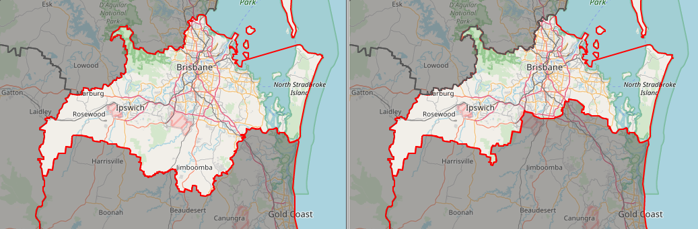

Simulated Boundary Change

- Origin data sourced from http://qldspatial.information.qld.gov.au/catalogue/custom/detail.page?fid={748509AE-14D2-42FC-BCD7-CDEAF31ED3DB}
- Logan LGA moved from South Coast to Metropolitan District
- converted to GeoJSON.

Packaged using recommendations in https://research.okfn.org/spatial-data-package-investigation/

Version 6.14.0

