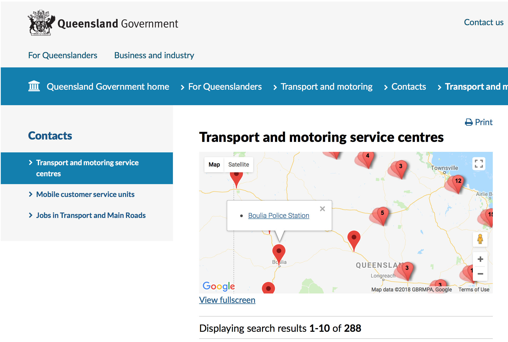

# Point Data User Stories

## Describe point data

```
As a Data Publisher
I want to describe point data in a data package
So that it can be validated, discovered and used with confidence
```

Supported by the using:
- the [`"spatial-profile": "tabular-points"`](https://research.okfn.org/spatial-data-package-investigation/#package-level-) property, to describe the type of spatial data in the data package
- the [`locations`](https://research.okfn.org/spatial-data-package-investigation/#point-datasets) `"type": "lat-lon"` property, to describe which columns represent `latitude` and `longitude`
- the correct data [`type`](https://frictionlessdata.io/specs/table-schema/#types-and-formats) for the fields representing `latitude` and `longitude`
- `minimum` and `maximum` [`constraints`](https://frictionlessdata.io/specs/table-schema/#constraints) to optionally restrict the `latitude` and `longitude` coordinate pairs to a geographic bounding box
- the [`spatialExtent`](https://hackmd.io/s/SyyEbQuEM#Describe-and-validate-the-spatial-extent-of-point-data) property to describe the geographic bounding polygon that the `latitude` and `longitude` coordinate pairs must be inside

*Note the lack of support for describing `latitude` and `longitude` coordinate pairs are required or optional. This can be partially achieved by putting a `required` `constraint` on both fields in the `schema` however it doesn't avoid the possibility of applying the `constraint` to only one of those fields*

*Note the lack of support for for describing `missingValues` for `latitude` and `longitude` coordinate pairs.

## Validate point data coordinates

```
As a Data Publisher
I want to validate `latitude` `longitude` coordinate pairs
So that I can correct any errors and share quality data, or explain the errors in the data
```

Supported by using software to check that `latitude` and `longitude` values match the data `type` and comply with any `constraints`.

## Validate point data is within geographic area

```
As a Data Publisher
I want to validate that all `latitude` `longitude` coordinate pairs are inside a referenced geographic area
So that I can correct any errors and share quality data, or explain the errors in the data
```

Supported by using software to check that `latitude` `longitude` coordinate pairs are inside the geographic area referenced by the `spatialExtent`.

## Discover point data

```
As a Data Consumer
I want to search for point data
So that I can quickly find the data I'm looking for
```

Supported by using software to search for data packages that include the `"spatial-profile": "tabular-points"` property.

## Discover point data within a geographic area

```
As a Data Consumer
I want to search for point data within a geographic area selected using a map
So that I can quickly find the data I'm looking for
```

Supported by using software to search for data packages that:
- include the `"spatial-profile": "tabular-points"` property
- have a `spatialExtent` that intersects with the searched geographic area

*Note the lack of support for point data constrained by a geographic bounding box. Is there a need to generate a `spatialExtent` from the `minimum` and `maximum` `constraints`that restrict the `latitude` and `longitude` values?*

*Another user story could be to discover point data using a name of a geographic area (e.g. town, state, country). The name could be converted to  a geographic area and then the above search performed.*

## Display point data on the Queensland Globe

```
As a Data Consumer
I want to display point data on the Queensland Globe
So that I can see the data on an online map
```

Supported by the `Add my data` function and uploading the point data CSV file to the [Queensland Globe](https://qldglobe.information.qld.gov.au/)


## Display Service location point data on qld.gov.au

```
As a Data Consumer
I want to display service location point data on qld.gov.au
So that I can see the data on an online map
```

Supported by custom software to read service location point data from data.qld.gov.au and use it to display service locations on a map and service details when that point is clicked


